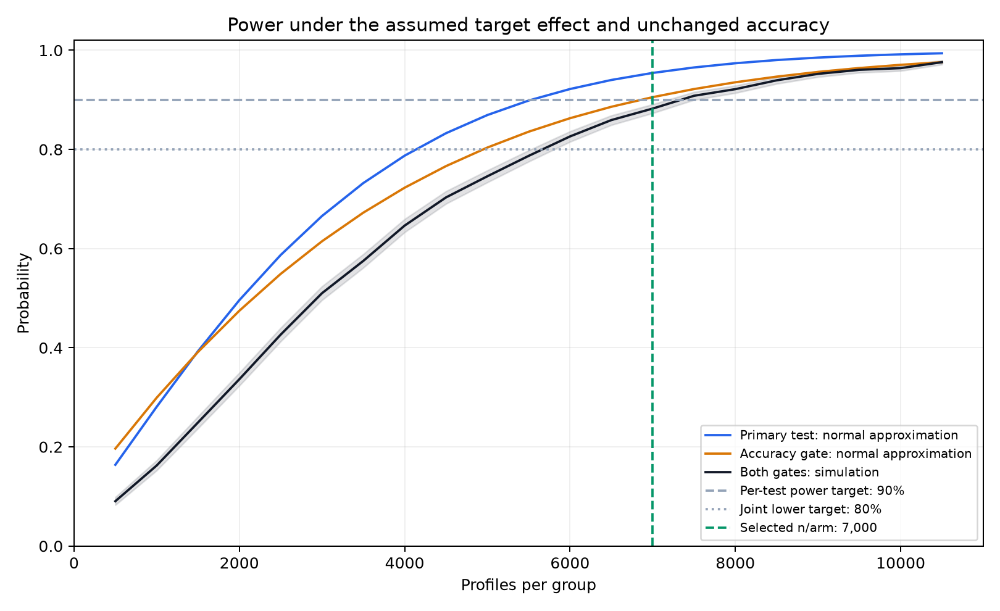
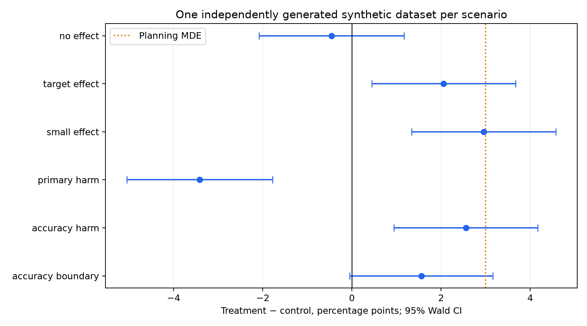

> An Experiment that's evaluating whether adding a Summarize button to the Chrome side panel helps users understand articles within 3 minutes without degrading overall comprehension.

This test evaluates real performance under time limits by pairing a superiority test for reading speed with a non-inferiority guardrail for answer accuracy.

---

## 1. Metric Definitions

Participants read 1,000–1,500 word factual articles and answer 5 comprehension questions. Passing requires getting at least 4 answers right.

* **Primary Metric (Timely Comprehension):** Passing (>= 4/5) in 180 seconds (3 minutes) or less.
* **Guardrail Metric (Eventual Comprehension):** Passing (>= 4/5) within the full 600-second (10-minute) limit.
* **Unsuccessful / Abandoned:** Failing the quiz, running out of time, or closing the tab.

Modeling outcomes through a nested 3-state structure where fast completion automatically counts as eventual success:
1. **Fast pass:** Clearing the quiz in <= 180s.
2. **Late pass:** Clearing the quiz between 180s and 600s.
3. **Unsuccessful:** Failing, timing out, or closing the tab.

---

## 2. Test Setup & Randomization

| Arm | User Experience |
| :--- | :--- |
| **Control** | Reading articles in the default Chrome view. |
| **Treatment** | Reading articles with an optional Summarize button opening a side-panel summary. |

* **Randomization Unit:** Unique Chrome profile ID (fixed 1:1 split).
* **Analysis Unit:** Unique Chrome profile ID, evaluating only the first task per profile.
* **Target Cohort:** Desktop Chrome users reading English-language articles with no prior exposure to the text.

---

## 3. Statistical Sizing & Targets

Setting historical baselines at a 60% timely pass rate and an 80% eventual pass rate.

| Parameter | Target | Rationale |
| :--- | :--- | :--- |
| **Baseline Timely ($p_0$)** | 60.0% | Historical 3-minute completion benchmark. |
| **Baseline Accuracy ($a_0$)** | 80.0% | Historical total pass rate benchmark. |
| **Minimum Detectable Effect (MDE)** | +3.0 pp | Smallest speed gain justifying UI clutter and upkeep. |
| **Non-Inferiority Margin** | -2.0 pp | Maximum acceptable drop in overall comprehension. |
| **Significance Level ($\alpha$)** | 0.05 | 5% false-positive threshold (two-sided primary, one-sided guardrail). |
| **Target Power ($1 - \beta$)** | 90.0% | Sizing target for both individual tests. |

### Sample Size Calculation
* **Primary Superiority Test:** Requiring 5,527 profiles per arm via pooled normal approximation.
* **Accuracy Guardrail:** Requiring 6,852 profiles per arm via one-sided Wald bound.
* **Selected Sample:** Rounding up to **7,000 per arm** (**14,000 total profiles**).
* **Enrollment Duration:** Enrolling 1,000 profiles/day requires **14 days**.

At 7,000 profiles per arm, theoretical power reaches 95.4% for the primary test and 90.5% for the accuracy guardrail.

---

## 4. Decision Framework

Advancing to production validation requires clearing two gates simultaneously:

1. **Gate 1 (Primary Speed Lift):** Checking if the two-sided pooled Z-test hits $p < 0.05$ with an observed positive effect ($\Delta > 0$).
2. **Gate 2 (Accuracy Guardrail):** Checking if the one-sided 95% Wald lower bound stays above the $-2.0\text{ pp}$ margin ($\Delta_{\text{NI}}$).

Failing either check flags the variant as **Do not advance**.

---

## 5. Simulated Scenarios

Running 5,000 Monte Carlo replications across 6 synthetic conditions:
* `no_effect`: Lift = 0 pp, Accuracy delta = 0 pp.
* `target_effect`: Lift = +3 pp, Accuracy delta = 0 pp.
* `small_effect`: Lift = +1 pp, Accuracy delta = 0 pp.
* `primary_harm`: Lift = -3 pp, Accuracy delta = 0 pp.
* `accuracy_harm`: Lift = +3 pp, Accuracy delta = -4 pp.
* `accuracy_boundary`: Lift = +3 pp, Accuracy delta = -2 pp.

---

<!-- RESULTS_START -->

## 6. Results & Analysis

### Single Experiment Realization ($N = 7{,}000$ per arm)

| Scenario | Timely Lift (pp) | 95% CI (pp) | Primary $p$-value | Accuracy Lift (pp) | One-Sided Lower Bound | Decision |
| :--- | :--- | :--- | :--- | :--- | :--- | :--- |
| `no_effect` | -0.46 | [-2.09, +1.17] | 0.5821 | -0.49 | -1.60 pp | Do not advance |
| `target_effect` | +2.06 | [+0.44, +3.67] | 0.0125 | -0.07 | -1.18 pp | Advance to real validation |
| `small_effect` | +2.96 | [+1.34, +4.57] | 0.0003 | +1.24 | +0.14 pp | Advance to real validation |
| `primary_harm` | -3.41 | [-5.05, -1.78] | 0.00004 | +0.07 | -1.04 pp | Do not advance |
| `accuracy_harm` | +2.56 | [+0.94, +4.17] | 0.0019 | -4.17 | -5.32 pp | Do not advance |
| `accuracy_boundary` | +1.56 | [-0.05, +3.16] | 0.0572 | -2.99 | -4.11 pp | Do not advance |

* In `accuracy_harm`, timely completion improves significantly ($p = 0.0019$), but the guardrail stops rollout because accuracy drops past the $-2\text{ pp}$ line (lower bound $-5.32\text{ pp}$).

### Monte Carlo Calibration (5,000 Replications)

| Scenario | Reject Primary $H_0$ | Significant Benefit | Pass Accuracy Gate | Advance Rate (Joint Power) | Primary 95% CI Coverage |
| :--- | :--- | :--- | :--- | :--- | :--- |
| `no_effect` | 4.98% | 2.44% | 90.70% | **2.44%** | 95.02% |
| `target_effect` | 95.26% | 95.26% | 90.84% | **88.34%** | 95.10% |
| `small_effect` | 23.92% | 23.86% | 90.22% | **23.78%** | 94.58% |
| `primary_harm` | 94.90% | 0.00% | 91.46% | **0.00%** | 94.96% |
| `accuracy_harm` | 95.64% | 95.64% | 0.00% | **0.00%** | 95.52% |
| `accuracy_boundary` | 95.18% | 95.18% | 4.68% | **4.68%** | 94.82% |

### Key Takeaways
1. **Tracking Joint Power:** Under target assumptions (+3 pp speed, 0 pp accuracy loss), passing both gates occurs **88.34%** of the time (95% Wilson CI: [87.42%, 89.20%]).
2. **Blocking Quality Drops:** In `accuracy_harm`, even when speed gains show significance, the advance rate drops to **0.00%** across all 5,000 runs.
3. **Controlling False Positives:** When no true effect exists, advancing occurs in only 2.44% of runs, staying within the 5% error limit.
4. **Calibrating Boundary Conditions:** Right on the $-2\text{ pp}$ boundary, non-inferiority passes in 4.68% of runs, matching the nominal 5% one-sided error rate.

<!-- RESULTS_END -->